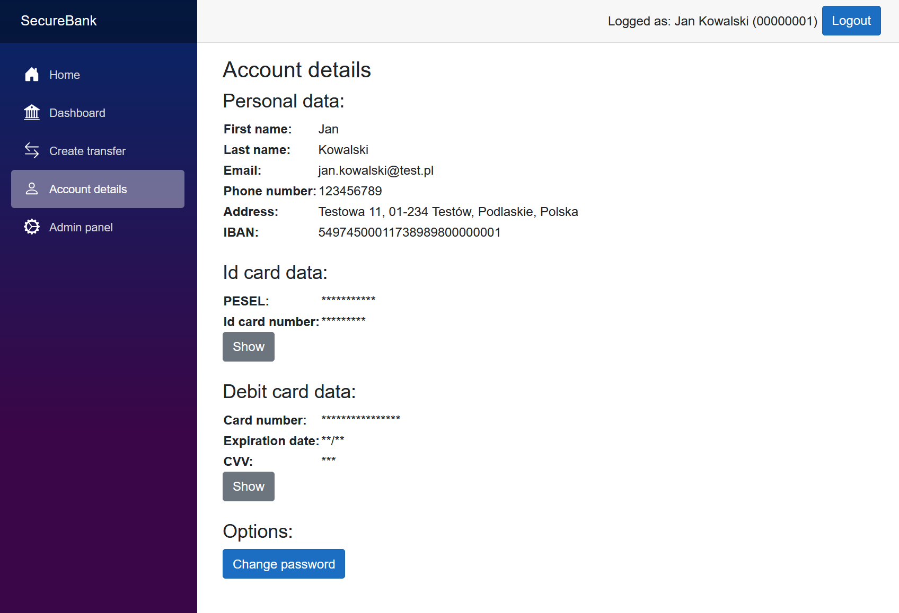

<h1 align="center">Secure Bank</h1>

<h3 align="center"><b>Simple secure web application for managing a bank account</b></h3>

Secure Bank was written in C#, in Blazor Server and ASP.NET Core Web API frameworks. It uses SQLite database to store data and communicates with it using Entity Framework Core. System uses Nginx as reverse proxy. This project was part of "Data protection in IT systems" course at Warsaw University of Technology.

---

## Informations

> [!IMPORTANT]  
> App is no longer maintained, but should work properly

## Features

- View account balance and transaction history
- Money transfers creation
- Hiding sensitive data in account details
- Possibility to change password
- Basic admin panel (create, remove and unlock accounts, create transfers between two accounts)
- Entering random characters from the password when logging in
- Account locking after 3 failed login attempts

## Installation and usage

The easiest way to use this app is to run it in Docker containers, using Docker compose file.

1. Make sure you have Docker installed
2. Clone repository
3. Open terminal in repository directory
4. Run `docker compose up -d` command

You can access app at https://localhost/ after accepting self-signed certificate.

**Login data for example admin account:**

Client code: `00000001` 
Password: `0T9jU#i`

You have to change password at first login.

## Attribution

You can copy this repository and create your own version of the app freely. However, it would be nice if you included URL to this repository in the description to your repository or in README file.

**Other sources:**

- Icon by <a href="icons8.com">Icons8</a>